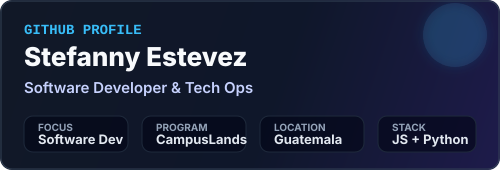
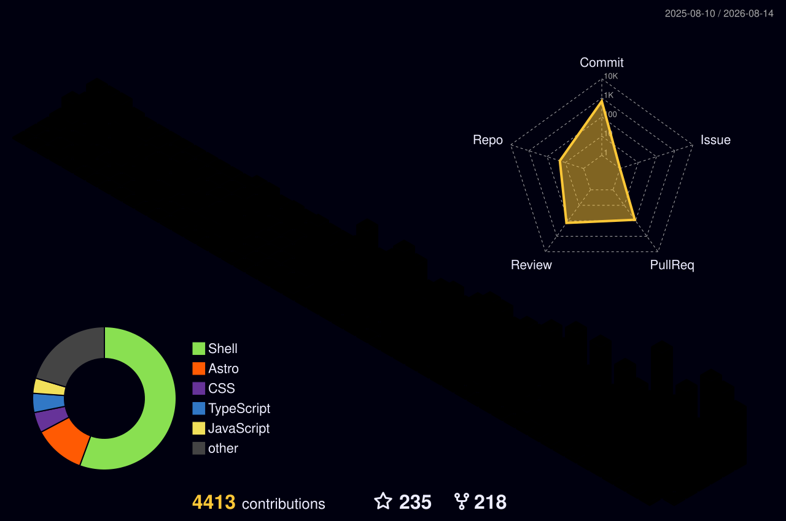

<div align="center">
  
</div>

<br />

<div align="center">
  <a href="https://github.com/StefannyEstevezSolares">
    
  </a>
  <a href="https://github.com/StefannyEstevezSolares?tab=repositories">
    
  </a>
  
</div>

<h1 align="center">Hola, soy Stefanny Estevez</h1>

<p align="center">
  <strong>Technology Professional | Software Developer in Training | Technical Support & Operations</strong>
  <br />
  Profesional bilingüe con más de 10 años de experiencia en soporte técnico, operaciones, servicio al cliente, liderazgo y educación. Actualmente en formación y transición profesional hacia el desarrollo de software, trabajando en programación web, bases de datos, automatización de procesos, Git, GitHub, Agile y Scrum.
</p>

<div align="center">
  <a href="https://github.com/StefannyEstevezSolares">
    
  </a>
</div>

---

## Qué hago

<table>
  <tr>
    <td width="50%">
      <h3>Desarrollo de software</h3>
      <p>Desarrollo aplicaciones web e interfaces dinámicas utilizando HTML, CSS, JavaScript y Python. Aplico lógica de programación, estructuras de datos, manipulación del DOM, eventos, validaciones y diseño responsive.</p>
    </td>
    <td width="50%">
      <h3>Bases de datos & SQL</h3>
      <p>Diseño y me relaciono con estructuras relacionales en SQL y MySQL: creación de tablas, relaciones (Primary/Foreign Keys), consultas avanzadas (SELECT, WHERE, JOINs) y procesos de normalización (1NF, 2NF, 3NF).</p>
    </td>
  </tr>
  <tr>
    <td width="50%">
      <h3>Automatización e integración</h3>
      <p>Construyo workflows de automatización mediante n8n e integro bots de Telegram utilizando Triggers, Inline Keyboards, Callback Queries y lógica condicional (Switch) para procesar eventos.</p>
    </td>
    <td width="50%">
      <h3>Soporte técnico, operaciones y liderazgo</h3>
      <p>Aporto más de 10 años de experiencia en diagnóstico técnico, gestión de incidencias, optimización de procesos operativos, liderazgo de equipos, servicio al cliente y metodologías ágiles (Scrum, Kanban).</p>
    </td>
  </tr>
</table>

---

## Stack principal

<div align="center">
  
</div>

<br />

<div align="center">
  
  
  
  
  
  
</div>

---

## Áreas de experiencia

<table>
  <tr>
    <td width="33%">
      <h3>Web & Frontend</h3>
      <ul>
        <li>HTML5, CSS3 y JavaScript</li>
        <li>Python y lógica de programación</li>
        <li>Responsive Web Design & Mobile First</li>
        <li>DOM, Eventos, Formularios y Validaciones</li>
        <li>Dashboards, Modales y Menús interactivos</li>
      </ul>
    </td>
    <td width="33%">
      <h3>Datos & Automatización</h3>
      <ul>
        <li>SQL y MySQL (Consultas, Tablas, Keys)</li>
        <li>Modelado Relacional y Normalización (1NF–3NF)</li>
        <li>Workflows automatizados con n8n</li>
        <li>Integración de Bots de Telegram & Callback Queries</li>
        <li>Estructuras de datos y resolución de algoritmos</li>
      </ul>
    </td>
    <td width="33%">
      <h3>Operaciones & Metodologías</h3>
      <ul>
        <li>Git & GitHub (Commits, Repositorios, Docs)</li>
        <li>Agile, Scrum, Sprints y Backlog (Jira / ClickUp)</li>
        <li>+10 años en Soporte Técnico & Operaciones</li>
        <li>Documentación de procesos y resolución de incidencias</li>
        <li>Docencia en Inglés & Capacitación Técnica</li>
      </ul>
    </td>
  </tr>
</table>

---

## Proyectos destacados

<table>
  <tr>
    <td width="50%">
      <h3>Medical Management System</h3>
      <p>Aplicación web para gestión clínica integral (Pacientes, Doctores, Citas y Pagos). Implementa operaciones CRUD, validaciones de negocio, modales, diseño responsive y prevención de conflictos de horario con JavaScript, HTML y CSS.</p>
    </td>
    <td width="50%">
      <h3>Expert System</h3>
      <p>Sistema experto en Python para el diagnóstico de fallas de computadoras. Utiliza base de conocimiento, reglas, hechos, motor de inferencia y cálculo de valores de confianza con resultados ordenados por relevancia.</p>
    </td>
  </tr>
  <tr>
    <td width="50%">
      <h3>Telegram Bot + n8n Workflow</h3>
      <p>Sistema de automatización de conversaciones integrando n8n y Telegram. Implementa Triggers, Inline Keyboards, Callback Queries y nodos condicionales Switch para la gestión interactiva de eventos.</p>
    </td>
    <td width="50%">
      <h3>Proyectos Frontend & Bases de Datos</h3>
      <p>Desarrollos prácticos como <em>One Piece Explorer</em>, <em>Poke Flights</em>, <em>Gym Manager</em> y ejercicios relacionales SQL (Cine, Biblioteca, Empleados, Clientes, Normalización y modelado de datos).</p>
    </td>
  </tr>
</table>

---

## Trayectoria profesional y habilidades clave

- **Soporte Técnico & Operaciones (+10 años):** Diagnóstico de sistemas, seguimiento de incidencias, documentación técnica y atención al cliente en entornos dinámicos.
- **Transferencia de conocimiento & Educación:** Experiencia como docente de inglés (TOEFL, Gramática, Conversación) con alta capacidad para explicar conceptos técnicos complejos.
- **Liderazgo & Coordinación:** Coordinación de equipos, gestión bajo procesos, resolución de conflictos y enfoque orientado a resultados.
- **Idiomas:** Español (Nativo), Inglés (Avanzado / Profesional), Francés (Bajo-Intermedio).

---

## Formación tecnológica

Desarrollo mi formación técnica en **CampusLands**, enfocándome en el aprendizaje basado en proyectos:
- Programación web en JavaScript, HTML5 y CSS3.
- Lenguaje Python y estructuras de datos.
- Bases de datos relacionales SQL y MySQL.
- Control de versiones con Git y GitHub.
- Automatizaciones con n8n e integración de servicios.
- Metodologías ágiles Agile/Scrum con herramientas como Jira y ClickUp.

---

## Actividad en vivo

<div align="center">
  
  
</div>

<div align="center">
  
</div>

<div align="center">
  
</div>

---

## Tarjetas automáticas

<div align="center">
  
  
  
  
  
</div>

---

## Cómo trabajo

```txt
Problema -> análisis -> diseño -> desarrollo -> pruebas -> documentación -> mejora continua
```

<table>
  <tr>
    <td>Aprendizaje práctico</td>
    <td>Aprendo construyendo proyectos reales y aplicando inmediatamente los conceptos a problemas concretos.</td>
  </tr>
  <tr>
    <td>Resolución estructurada</td>
    <td>Descompondo problemas en componentes más simples para construir soluciones limpias y mantenibles paso a paso.</td>
  </tr>
  <tr>
    <td>Pensamiento lógico</td>
    <td>Transformo requerimientos en reglas de negocio, algoritmos, flujos de datos y código eficiente.</td>
  </tr>
  <tr>
    <td>Visión integral</td>
    <td>Combino mi experiencia en soporte, operaciones, liderazgo e idiomas con desarrollo de software para crear soluciones que generen valor real.</td>
  </tr>
</table>

---

## Contacto

<div align="center">
  <a href="https://github.com/StefannyEstevezSolares">
    
  </a>
</div>

<br />

<div align="center">
  <strong>Disponible para desarrollo de software, automatizaciones con n8n, diseño de bases de datos, soporte técnico y proyectos tecnológicos.</strong>
</div>
